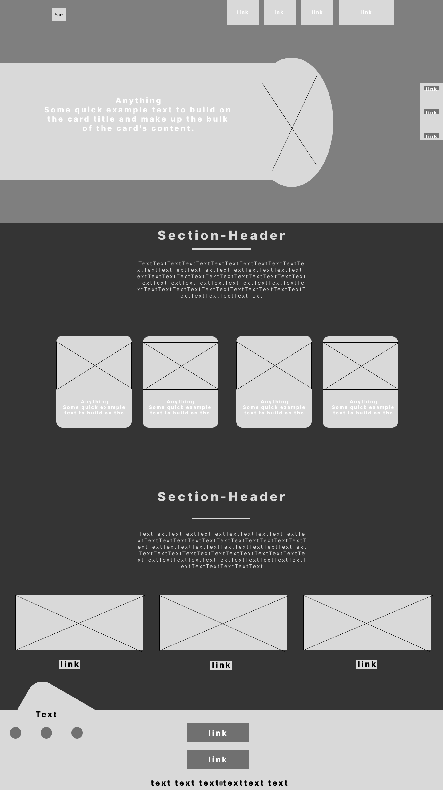

# **Portfolio**
## **Description**
It's a Portfolio-project in (HTML, CSS & BootStrap) with skelton made using Html designed by CSS.

## What are the tools you used to create it? 
- Figma
- GitHub
- Visual Studio Code
- bootstrap

## HTML & CSS
- [***HTML***](../Html/Index.html)
- [***CSS***](../CSS/main.css)

## **Wireframe** 
[***Wireframe***](https://www.figma.com/file/6yxKMtfVExgRZ8khtoH3Dt/Portfolio?node-id=0%3A1&t=vhA3AukOeS1PMnTT-1)

## **Mockup** 
[***Mockupe***](https://www.figma.com/file/6yxKMtfVExgRZ8khtoH3Dt/Portfolio?node-id=0%3A1&t=vhA3AukOeS1PMnTT-1)

